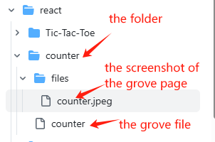
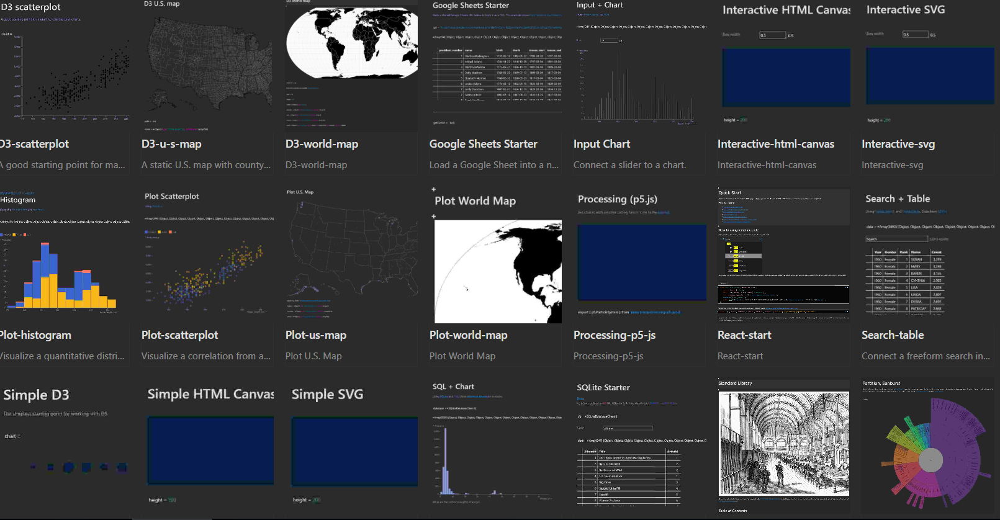
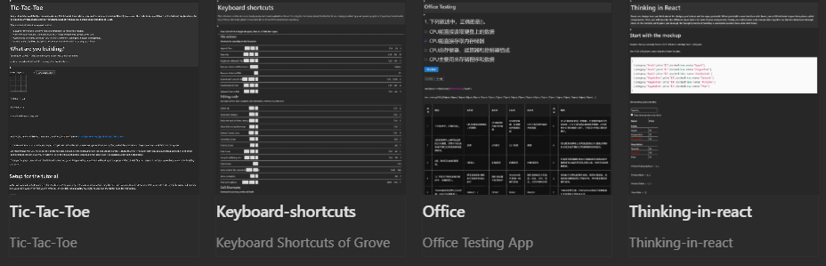

# Grove Examples

This repository contains example notebooks and supporting code based on work from Grove.  
Grove makes it easy to create, remix, and share interactive data visualizations and computational notebooks.  

## 📂 Grove Store Contents
- `template/` – Example notebooks
- `react/` – React example notebooks
- `NeoDashDashboardGallery/` - Neo4j dashboard gallery

## Upload to grove store

we can create folder in `template/`、 `react/` 、`NeoDashDashboardGallery/`, and upload grove and screenshot here.  

for example:  

If we want create a item in `react/` gallery

Fig 1: The structure of the display page

`the folder`: the item name will display in grove store.

`files/`:  Store the attachments and screenshot of current main grove page. The screenshot name must be the same as grove page. Notice: As we edit the page in grove. We can set a preview image and it can take the screenshot of grove page.

After do that, we can see the grove page link in grove store.

## 🚀 Usage

1. Open Graphxr's grove extension.
2. Zip the files and import it into grove extension.
3. Open the notebook in grove to explore the interactive visualization.

## 🔗 Example Notebooks

Here are some template examples. Including how to use tables, plot charts, D3 charts, React program examples, etc.

Here are some react app examples.

## 🙏 Acknowledgments
Special thanks to the authors of the original notebooks on [ObservableHQ](https://observablehq.com).  
This repository would not be possible without their contributions to the open-source and data visualization communities.